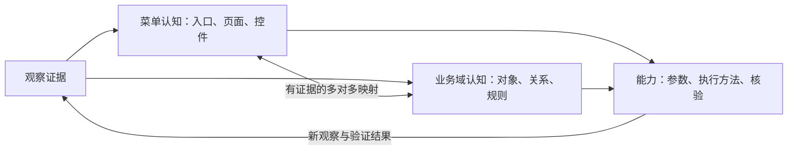

# 学习模型与探索协议

更新日期：2026-09-11。状态：已接受的设计；两套知识模型、版本关系、证据和指定命题的用户确认已实现，自动四级探索、行为验证和能力演进尚未实现。当前代码边界见 [知识说明](knowledge.md)。

本文是认知模型、探索状态、关联规则和能力契约的权威说明。[第一版规划](v1-plan.md) 定义交付范围与验收，[ADR 0002](adr/0002-menu-first-domain-learning.md) 记录取舍。示例用于表达设计，不代表已经核实某个 ERP 的业务规则。

## 1. 学习主线

**先形成基于菜单的认知，再依据页面证据形成业务域认知，建立双向关联。**

`菜单结构认知 → 页面证据积累 → 业务域认知 → 双向关联 → 持续深化`

首次从当前企业、账号、角色可见的全局菜单入手，按轮次先观察、后解释。业务理解可以指导下一轮探索，但不能反过来修改原始观察。完成全局结构扫描后，由业务关联、知识缺口和用户任务共同决定纵深优先级。

全局视角是默认起点，不要求所有页面、状态和操作都验证完才能使用。用户可查看部分结果、暂停学习或插入任务；恢复后继续未完成的全局队列，不把局部任务成果伪装成全局完成。

## 2. 两套认知模型与能力资产

| 资产 | 回答的问题 | 内容 |
| --- | --- | --- |
| 菜单认知模型 | 功能在哪里，页面实际呈现什么？ | 菜单、页面、Tab、字段控件、按钮、子窗口、导航路径及页面上下文 |
| 业务域认知模型 | 系统管理什么业务，各对象如何关联？ | 业务域、业务对象、字段语义、状态、规则、流程和跨域关系 |
| 能力定义 | AI 学会了什么，如何再次执行和核验？ | 用途、参数、结果、适用条件、执行方法、依赖和结果核验 |

菜单不是业务域的直接分类表。一个业务域可跨多个菜单，一个页面也可关联多个领域；同一个业务字段可由多个页面控件呈现。界面层级、业务分类和认知状态分别维护。

例如，菜单中的“采购入库”页面可以展示“入库单”，归属“库存”领域，并关联“采购履约”。这些是待证据支持的不同关系，而不是通过菜单名称自动确认的一个标签。

### 身份与上下文

节点使用稳定 ID；名称、路径、URL 和定位信息为可变化属性。页面身份结合站点、路由、页面类型、Tab、弹窗和必要上下文，不能只用 URL 或显示名称。一个业务对象的多条单据通常是观察样本，不应无限生成新的页面类型。

每条关键记录至少带：站点与企业范围、可见角色/权限上下文、来源、证据引用、发现时间、最后复核时间、记录版本和可信状态。首次“全局”明确指当前可观察范围，不推断隐藏角色的功能。

## 3. 关联、证据与语义

菜单结构关系可包含：父子菜单、入口打开页面、页面包含 Tab 或控件、操作打开子窗口、关联入口跳转页面。

业务关系可包含：对象属于领域、对象引用对象、字段表示业务含义、状态转换及条件、流程依赖。映射关系需说明具体含义，例如“页面展示对象”“控件呈现字段”“按钮触发操作”“入口支撑流程”。

每条重要映射或业务结论记录：

- 两端节点及关系含义。
- 支持或反驳它的观察、文档或用户说明。
- 适用企业、角色、页面或单据状态。
- 可信状态、验证方式与时间。
- 依赖的节点或规则版本。

原始观察、AI 解释、用户修订和验证结果分开保留。新解释不覆盖历史证据；解释被否定时记录修订关系，并更新当前有效视图。

用户应能双向查询：从菜单查看所属业务、对象和规则；从业务概念定位菜单入口、页面、字段及证据。孤立且无证据的概念可以保留为假设，不计入已确认映射。

## 4. 四级探索

| 层次 | 任务 | 产出 | 本轮完成判断 |
| --- | --- | --- | --- |
| L1 全局入口 | 枚举当前角色可见一级菜单及主要导航入口 | 菜单骨架、系统范围、后续队列 | 已发现入口完成枚举与去重，未覆盖范围和阻塞已记录 |
| L2 功能结构 | 展开二三级菜单并观察主要页面；继续处理更深的导航分支 | 功能地图、页面类型、业务对象候选和初步关联 | 本轮结构队列处理完；各分支已观察或有明确阻塞记录 |
| L3 页面细节 | 按业务域深入 Tab、筛选、表格、表单、按钮和子窗口 | 字段知识、交互地图、操作目录 | 指定范围已观察；无法到达或可能有副作用部分明确标记 |
| L4 业务行为 | 验证操作前置条件、校验、子窗口内行为、状态变化及结果 | 业务规则、能力验证记录和失败证据 | 指定案例核验通过或明确失败；未验证行为不能算成功 |

这是认知探索层次，不是限制 ERP 必须有四级菜单。多层弹窗仍可属于 L3；一个浅层菜单上的操作也可能需要 L4 验证。发现按钮、理解用途和执行成功是不同成果。

每轮先更新结构与页面证据，再综合业务假设和映射。全局先广后深：不在某个分支反复钻取而长期忽略其他一级菜单。L3/L4 优先处理被选业务域，跨域发现及时回填全局框架。

## 5. 探索队列、预算与停止条件

每轮保存范围快照、层次、待探索节点、已处理入口、重试次数、预算、暂停原因和可恢复位置。具体预算由产品默认值或用户设置给出，并在运行记录中保留，不写死未经测试的耗时承诺。

- 对导航和页面类型去重，区分同一入口的别名与不同上下文。
- 页面列表记录与分页采用有范围采样，不因每张订单或每页数据产生无限结构队列。
- 正常结束以本轮发现的结构队列处理完成为准，不宣称未知功能已全部发现。
- 达到时间、步骤或模型调用预算，用户接管，登录过期或出现未知副作用时暂停并保留进度。
- 暂时性错误有限重试；不可达入口记录原因和复查条件，避免空转。
- 新入口加入下一轮或当前剩余预算；已有结论按新证据修订。

轮次状态使用“运行中、已暂停、本轮已结束、已取消”。本轮结束可以带阻塞项；范围快照、剩余问题和覆盖情况必须一起展示。预算耗尽是暂停，不应显示为全局探索完成。

## 6. 认知状态与覆盖

认知进度与问题状态独立保存，避免一个“完成”字段混淆所有情况。

| 认知进度 | 含义 |
| --- | --- |
| 已发现 | 知道入口、控件或概念存在，尚未充分观察 |
| 已观察 | 有当前范围内的直接页面或其他来源证据 |
| 已解释 | 有语义解释或业务假设，注明依据与不确定性 |
| 已验证 | 明确命题在指定条件下获得核验，记录方法和时间 |

“阻塞、存在冲突、需要复核”作为独立状态或标记，不丢弃已经获得的认知。不同实体不必机械经过全部状态：菜单可以直接验证存在性，规则可以从文档提出；验证只针对明确命题，不能将“页面可打开”扩展成“所有业务规则可信”。

覆盖分开呈现：

- **结构覆盖**：本轮已发现入口和页面类型中，已观察、待处理和阻塞的数量。
- **语义覆盖**：已解释或验证的字段、概念和映射，另列未知与冲突。
- **行为覆盖**：已发现操作中，哪些有指定案例的验证，哪些仅观察到按钮。

分母限定为本轮已发现范围，未知总体不显示虚假的 100%。结构枚举完整性还需与独立人工清单抽查，不能仅以爬取器自己发现的节点证明无遗漏。

## 7. 从方法到能力

借鉴 CLI-Anything 的自描述、参数化和真实结果验证方式，但首版使用 dsh 原生工具，不额外建设 CLI 产品或要求用户手写命令。

能力定义至少包含：稳定 ID 与版本、业务用途、输入与输出契约、企业/角色范围、页面与规则依赖、前置条件、执行方法、可能副作用、结果核验方式及验证记录。

生命周期为“候选、可复用、需复核、已停用”。一次成功操作可以生成候选；能否发布为可复用能力取决于参数化是否成立、适用条件和核验案例。失败或页面变化触发重新观察，AI 仍可自主处理尚无能力覆盖的任务。

示例能力 `purchase.orders.findPendingReceipt` 接收供应商与日期范围，返回订单、筛选条件、采集时间及证据；它必须关联实际 ERP 的字段、未入库定义和分页处理，不能仅凭名称承诺准确结果。

能力不是永久授权。执行代码必须走受控接口；复用批准过的执行方法仍须为每次具体业务写入重新获得授权。有正式且经过验证的 API 时可以作为执行绑定，但不因观察到一个请求就自动认定接口可安全重放。

社区分享可包含脱敏的契约和映射模板，不能携带私人证据、订单数据或登录态；导入其他站点经验需重新核对适用条件。

## 8. Schema、文档和动态知识

结构化记录是权威定义，文档是阅读与编辑视图。约束、语义解释、证据和授权承担不同职责。

| 对象 | 定义方式 |
| --- | --- |
| 固定 dsh 工具的参数和结果 | 优先使用目标版本原生 Schema 与校验，不另手写一份等价 Zod |
| AI 学到的字段、关系、能力 | 可序列化的数据契约，保留版本、描述、来源及不确定性 |
| 内部导入文件或进程消息 | 原生机制不足时按需要使用 Zod，不因 Node 环境就强制引入 |
| 帮助和字段说明 | 从契约及业务元数据生成，修订经校验写回权威记录 |
| 实时业务条件和写入授权 | 执行时检查，不能由 Schema 校验替代 |

观察到的状态值记录为 `observedValues`，另存完整性如 `unknown`；只有确认了值域，才能提升为排他枚举约束。Schema 验证成功不代表业务语义已经验证。

不默认生成并执行 Zod 源码作为动态知识存储。若引入转换器，只支持明确子集，遇到不支持的约束报错；不静默丢失限制，也不假设 Zod 导出的 JSON Schema 都能直接交给 dsh。

## 9. 变化、冲突和局部复核

建立依赖链：观察证据 → 菜单或页面记录 → 业务解释与映射 → 能力。引用具体记录版本，支持定位变化影响范围。

- 菜单改名或移动：保留旧入口证据，更新映射，受影响导航方法需复核；业务概念不自动删除。
- 字段、枚举或规则变化：相关结论及能力标记需复核，复核前不将旧约束用于关键操作。
- 权限或企业切换：重新确定观察范围，不能将暂时不可见直接解释为功能已删除。
- 新证据与用户确认冲突：保留双方依据，必要时集中询问，不静默覆盖。
- 删除或修订：同步更新检索、文档视图和依赖记录，保留必要版本历史。

人工介入主要发生于影响当前任务的关键歧义、规则冲突和业务写入。菜单与字段事实自动记录，推断可参与分析但标识不确定性；不以逐条人工审批替代 AI 学习。

## 10. 观察与操作的边界

探索可确认无业务副作用的导航、展开和 Tab；不能为了覆盖率逐个执行所有按钮。对未知行为先记录、分析证据或请用户示范；可能写入时遵循总规划的业务确认流程。

自动保存、打开即创建对象、审核或作废都需在首次可能写入前确认。隐含行为无法通用保证识别，初次探索优先只读权限，深层验证使用测试环境。页面内容不能改变工具授权，任意代码或直接网络访问不能绕过批准。

历史业务数据与系统认知分开管理，洞察说明数据时间、范围、推断及缺口。原始登录凭据与会话令牌不进入知识或证据文档。

## 11. 方法参考

以下为已讨论的方法依据，不表示直接安装这些项目或照搬其数据模型。引入具体代码时按所用版本核对许可证。

- [CLI-Anything 方法](https://github.com/HKUDS/CLI-Anything/blob/main/cli-anything-plugin/HARNESS.md)：能力自描述、参数化及真实结果验证。
- [AnythingGraph Playbooks](https://github.com/AnythingGraph/AnythingGraph/blob/main/playbooks/README.md)：业务词汇与实际来源绑定分离。
- [dsh 目标版本工具 Schema](https://github.com/deepseek-ai/deepseek-harness/blob/dsh-v0.1.5-rc.2/docs/subsystems/tools.md)：宿主工具契约及受支持子集。
- [Zod 元数据](https://zod.dev/metadata)、[JSON Schema 转换](https://zod.dev/json-schema)：内部契约可选方案及转换边界。
