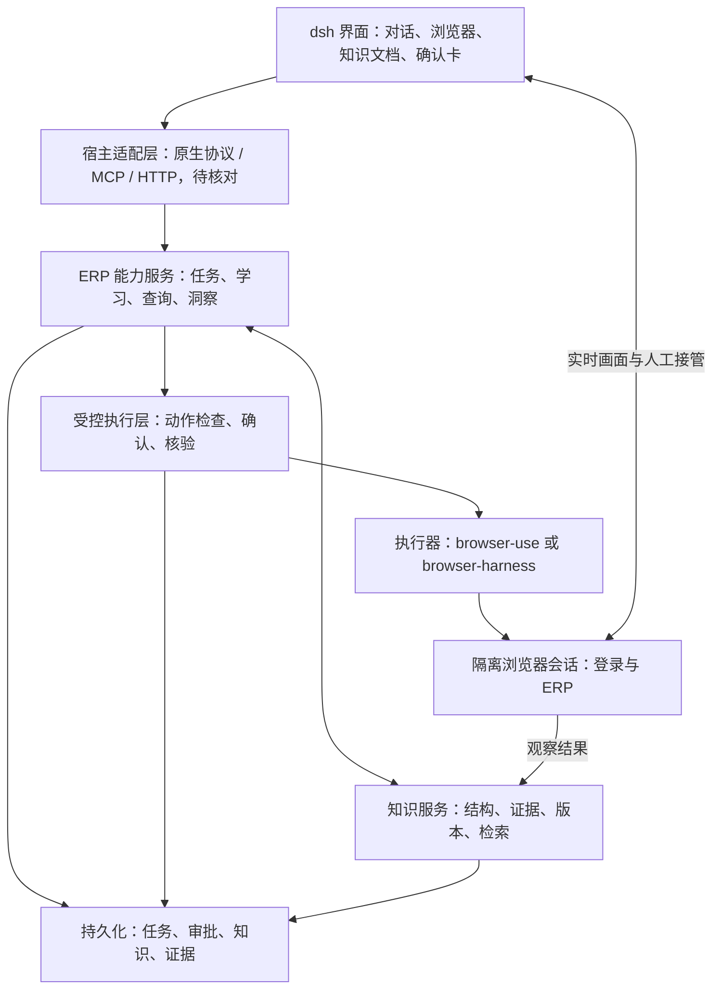

# 第一版规划

日期：2026-09-11。目标宿主：**dsh 0.1.5 rc2**。

本文记录已确认的产品与架构方向，不表示能力已经实现。宿主接口和目标 ERP 尚待验证；依赖版本在兼容性验证后锁定，不推测 dsh 的版本标签格式或插件 API。

## 1. 产品目标

通过用户登录后的浏览器逐步学习 ERP，形成网站地图、菜单地图、业务领域理解、字段词典、状态值、业务关系和可复用操作经验。帮助用户解释页面、查询数据，并在证据充足时提供业务洞察。

第一版只覆盖一个 ERP、一个角色、采购或库存中的一个业务域。最先验证用户使用后能看到学到了什么、修订知识、可靠完成常用查询，以及确认后执行一个测试环境写入流程。

- **ERP 业务写入**：每次固定确认具体变更，历史授权不能覆盖后续不同变更。
- **内部知识写入**：在用户开启的学习范围内自动积累，可查看、纠正和删除；未验证推断不得自动升级为确认规则。

第一版不承诺任意 ERP 的全站理解、完整状态机推导或无限制自主写入。支付等真实外部副作用不纳入验证，写入使用测试环境和测试数据。

## 2. 架构与组件

采用薄插件、独立 ERP 能力服务和可替换浏览器执行器。初期为一个插件、一个模块化服务、一个数据库及独立浏览器进程，不提前拆分微服务。

| 层 | 选择 | 边界 |
| --- | --- | --- |
| 插件入口 | dsh 0.1.5 rc2 原生机制 | 核对后决定是否使用 MCP，不假设支持内嵌界面 |
| 能力服务 | Python 模块化服务 | 直接复用浏览器与知识库组件 |
| 浏览器执行 | 默认验证 browser-use library | 插件内部承载任务，需覆盖内部动作控制 |
| 轻量执行备选 | browser-harness | 宿主已有完整代理循环时评估，不与 browser-use 串成必经链路 |
| 任务编排 | 宿主优先，LangGraph 备选 | 宿主缺少持久暂停、审批和恢复时才引入 |
| 权威存储 | PostgreSQL | 任务、审批、结构化知识、版本及证据引用 |
| 图谱检索 | Graphiti 按需引入 | 可重建的关系索引，不是第二份权威知识源 |
| 文档管理 | Markdown 视图＋结构化编辑 | 解析校验后更新知识版本 |
| 附件 | 初期文件存储 | 按规模迁移对象存储，数据库保存引用 |
| 浏览器界面 | 现成 Live View 或本地窗口 | 按宿主能力、企业网络和数据要求确定 |

只保留一个主要任务状态管理者。浏览器适配层抽象观察、受控动作、会话管理、人工接管、结果与证据，不复制上游全部 API。

Stagehand、Skyvern 作为比较基准，第一版不叠加多套执行引擎。GraphRAG 留待大批 ERP 文档关联问答需求出现后评估。

自研集中于 ERP 知识结构、证据验证与纠错、受控执行、结果核验和操作复用。浏览器控制、通用检查点和图谱基础设施复用成熟组件。

## 3. 登录、会话与部署

直接 iframe 加载 ERP 地址受目标网站嵌入策略和同源策略限制，不能作为通用方案。推荐嵌入受控浏览器的 Live View；ERP 在该浏览器内正常加载。Browser Use Cloud 和 Browserbase 有现成能力，但属于独立托管服务，不等于开源库自带完整内嵌产品。

流程为：创建隔离会话 → 暂停代理 → 用户扫码或完成其他登录 → 核对企业、账号、角色 → 开始指定范围的学习。扫码依赖 ERP 自身支持。人工与代理互斥控制，用户可随时接管。

企业内网优先本地或内部执行器，第一版允许独立浏览器窗口。云方案需验证网络可达性、数据边界及成本。Cookie、令牌和登录态留在受控会话，不进入知识文档；证据按需脱敏，不默认全量录制。会话与知识均按企业、用户及权限隔离。

## 4. 知识模型与文档

| 数据类别 | 示例 | 生命周期 |
| --- | --- | --- |
| 结构知识 | 菜单、页面、字段、枚举、业务关系、规则 | 版本化，变化后重新验证 |
| 操作经验 | 查询步骤、前置条件、结果校验 | 验证后发布，页面变化时可能失效 |
| 业务观察 | 某时刻库存、订单状态、异常线索 | 带采集时间，按需过期，不代替实时查询 |

初始实体：站点、菜单、页面、业务对象、字段、状态值、业务规则、操作流程、证据。初始关系：菜单包含页面、页面展示对象、对象拥有字段、字段引用对象、字段允许值、状态转换、流程依赖。

每条关键知识记录稳定 ID、站点/企业/角色范围、来源和证据、发现及验证时间、版本、适用期与验证方式。可信状态包括已观察、待验证推断、已验证、冲突和失效。

页面身份不能只看 URL，还需考虑页面类型、路由、弹窗及标签等上下文。观察到几个状态不代表完整枚举，更不代表完整状态机；转换需记录条件、角色与证据。模型置信度不等于已验证，未知项明确标记未知。

PostgreSQL 中经过校验的版本化记录是唯一权威来源。Markdown 是阅读与编辑视图，JSON/YAML 可用于导入导出；文档修改经解析、校验和差异处理后生成新版本。图谱与检索是可重建索引，记录对应版本。删除和修订应同步影响索引，避免旧知识继续被引用。

## 5. 持续学习与洞察

`页面观察 / 用户示范 → 知识候选 → 去重和冲突检查 → 验证 → 发布版本`

- 菜单路径、字段标签等可观察事实允许自动记录，保存适用范围。
- 业务含义和状态规则需要可靠文档、用户确认或已验证流程等依据。
- 新观察不能静默覆盖用户确认的规则，冲突进入待处理状态。
- 成功操作经过结果校验后形成流程候选；生成的 helpers 或脚本不能直接获得执行权限。
- 复用前检查角色、页面特征和前置条件；失败后重新观察，不无限重试。
- 页面文字与学习材料属于待分析证据，不能修改权限或绕过确认。

洞察基于已验证规则、本次数据和明确查询范围，并展示来源、采集时间与不确定性。第一版以解释和查询为主，规则及数据充分时才提出异常线索。历史截图不能代表当前库存。

## 6. 写入确认与失败恢复

`观察 → 变更计划 → 等待确认 → 重新校验 → 执行 → 回读核验 → 记录结果`

确认卡展示企业、业务对象、操作类型、字段前后值、影响条数和已知副作用。授权绑定用户、具体变更与作用范围；目标或内容改变、授权过期时重新确认。拒绝或取消后不得执行。用户响应由可信宿主或服务接收，模型不能自行授予批准。

控制覆盖实际执行路径，不能只包装最外层任务。自动保存字段需在首次可能落库的输入前确认；审核、作废、关账也是写入。HTTP 方法不能作为读写判据。未知行为暂停，通用代理不得获得绕过审批的任意 JS、原始 CDP、网络或脚本执行通道。

步骤结束 hook 无法充当写入前拦截器。第一版以只读账号学习，仅开放已验证的写入流程；通用提示词不能保证任意陌生 ERP 无误写。

审批和写入分为不同执行节点。LangGraph 等组件的恢复可能重执行节点开头的代码，因此恢复逻辑不能直接重复业务副作用。任务恢复后核对浏览器是否存活、登录是否有效、企业和页面是否变化，检查点不等于浏览器会话恢复。

写入超时进入“结果待核验”，先查询 ERP 判断是否生效，不能直接重试。工作流恢复不提供 ERP 业务 exactly-once 保证；有业务唯一标识或幂等机制时使用，结果不明确时交由用户处理。

## 7. 阶段与验收

| 阶段 | 交付物 | 完成条件 |
| --- | --- | --- |
| 0. 适配验证 | 宿主接口记录、依赖版本、浏览器会话 | 核对插件加载、工具、界面、审批、持久任务，确定主执行器和状态管理者 |
| 1. 只读探索 | 登录接管、菜单地图、页面索引 | 一个 ERP/角色/业务域可重复探索，有证据，无未授权业务写入 |
| 2. 知识纠错 | 字段词典、已观察枚举、可编辑业务说明 | 知识可追溯、可修订，未知与冲突可见，索引版本一致 |
| 3. 查询复用 | 少量已验证查询流程 | 重复执行并核验，记录成功率、耗时、模型成本和人工介入，覆盖页面变化 |
| 4. 测试写入 | 一个必须确认的测试环境流程 | 覆盖拒绝、变更后重确认、中断恢复、超时核验和防重复提交 |

首个贯穿案例：登录 → 学习菜单域 → 生成字段文档 → 用户修订 → 重复查询 → 测试环境确认后写入 → 中断恢复并核验。

验收使用目标 ERP 测试案例和期望结果，不以演示视频或上游通用基准替代。至少验证：

- 人工核对字段、枚举与关系，未验证推断不得标记为确认规则。
- 关键知识具备证据、作用域和版本，修订后答案引用新版本。
- 查询核对真实结果、筛选条件、分页和数据时间。
- 比较首次和重复执行的耗时、推理成本与人工介入次数。
- 确认前、拒绝后、授权失效或目标变化后均不发生未批准写入，覆盖自动保存和旁路工具。
- 覆盖服务重启、浏览器丢失、登录过期、人工接管和提交超时。
- 不同企业、用户、角色不能访问无权查看的会话和知识。

成功率与耗时目标在首批测试建立基线后确定；未授权业务写入属于发布阻断问题。

## 8. 待核对事项

1. dsh 官方仓库、0.1.5 rc2 对应版本，以及插件 SDK、协议、身份、界面、权限、审批和持久任务接口。
2. 首个 ERP、测试入口、业务域、只读角色和测试写入账号。
3. 本地、内网或云部署要求，模型与存储的数据边界。
4. browser-use 扩展点能否覆盖全部允许动作；不足时缩小范围或替换执行方式后再开放写入。
5. 锁定依赖版本、上游许可证、服务条款和目标 ERP 实测结果。

接口核对完成前不生成假设性的插件清单，也不声称已兼容 dsh。

## 9. 调研依据

以下资料会随上游版本变化，实现时按锁定版本复核。

- [browser-use](https://github.com/browser-use/browser-use)、[自定义工具](https://docs.browser-use.com/open-source/customize/tools/basics)、[生命周期 hooks](https://docs.browser-use.com/open-source/customize/hooks)。
- [browser-harness](https://github.com/browser-use/browser-harness)、[MCP 工具](https://github.com/browser-use/browser-harness/blob/main/docs/MCP.md)。
- [Browser Use Live View](https://docs.browser-use.com/cloud/browser/live-preview)、[人工介入](https://docs.browser-use.com/cloud/agent/human-in-the-loop)、[Browserbase Live View](https://docs.browserbase.com/platform/browser/observability/session-live-view)。
- [LangGraph interrupts](https://docs.langchain.com/oss/python/langgraph/interrupts)：暂停、恢复及节点重执行语义。
- [Graphiti](https://github.com/getzep/graphiti)、[GraphRAG](https://microsoft.github.io/graphrag/index/overview/)。
- [Stagehand 缓存](https://www.browserbase.com/blog/stagehand-caching)、[Skyvern 工作流](https://www.skyvern.com/docs/developers/getting-started/core-concepts)、[WalkMe DeepUI](https://support.walkme.com/knowledge-base/deepui-element-recognition/)。
- [MDN 同源策略](https://developer.mozilla.org/en-US/docs/Web/Security/Defenses/Same-origin_policy)。
