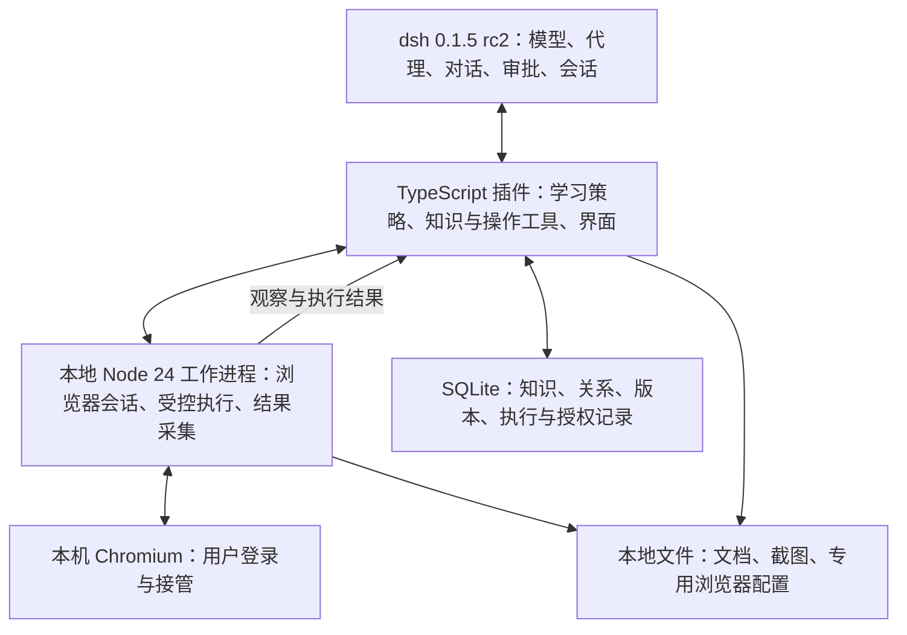

# 第一版规划

更新日期：2026-09-11。状态：已确认方案，尚未实现或完成运行验证。

目标宿主：**dsh 0.1.5 rc2**，官方标签 [`dsh-v0.1.5-rc.2`](https://github.com/deepseek-ai/deepseek-harness/tree/dsh-v0.1.5-rc.2)。运行时基线：**Node.js 24 LTS**。

本文件是当前执行方案，取代此前 Python 服务与 PostgreSQL 的默认设计。取舍依据见 [ADR 0001](adr/0001-local-first-ai-erp.md)。

## 1. 核心原则与产品范围

1. **效果第一**：真实任务正确率和恢复能力优先于语言统一、依赖数量、耗时与模型成本。
2. **信任 AI 能力**：自主探索、理解、纠错和积累方法，不要求开发者预写每个 ERP 流程。
3. **方便单机启动**：用户本机运行 dsh 后安装插件即可配置和登录；允许包体较大，依赖由插件管理。
4. **业务写入固定确认**：每次确认具体业务变更，批准后 AI 自主完成范围内的必要步骤。

产品学习网站与菜单地图、页面结构、业务领域、字段含义、枚举、业务关系和操作经验，用于解释、查询与有依据的洞察。第一版聚焦一个 ERP、一个角色、采购或库存中的一个业务域。

首次接入做有范围的勘察，之后边做任务边学习，不以完成全站扫描或完整知识图谱为使用前提。不承诺自动获得全部枚举、完整状态机或任意 ERP 的可靠写入能力。

ERP 业务写入每次确认；插件内部事实、推断和方法在开启的学习范围内自动记录，可查看、修订与删除。写入验证使用测试环境和测试数据，支付等真实外部交易不纳入验证。

## 2. 已核实基础与待验证边界

已阅读目标标签的官方架构、模型服务和工具执行管线。该版本提供模型适配、代理循环、工具注册、执行前拦截、审批及会话持久化等扩展基础，因此不再另建一套主代理编排。

这些是官方资料层面的依据，不等于插件已加载成功、审批已覆盖全部路径或进程崩溃后可以恢复。具体接口签名、插件打包、界面挂载、Node 24 兼容性及运行时行为仍须实测。

## 3. 架构与职责

| 部分 | 第一版决定 | 边界 |
| --- | --- | --- |
| 宿主入口 | 原生 dsh 插件 | 首版不额外套 MCP，不修改宿主核心 |
| 运行时 | Node 24 LTS | 仅支持该大版本，构建锁定经过验证的具体版本 |
| 语言 | TypeScript | 发布编译后的 JavaScript，用户不需要编译工具链 |
| 模型与主代理 | 复用 dsh | 模型调用走宿主服务，适配能力需实测 |
| 宿主交互 | 复用工具管线与审批 | 插件补充 ERP 授权范围及执行前核对 |
| 本地执行 | 插件托管 Node 工作进程 | IPC 或 stdio 通信，无额外 HTTP 服务或固定端口 |
| 浏览器基础 | Playwright＋受支持 Chromium | 提供操作基础，不等同于完整浏览器智能 |
| 知识与执行记录 | SQLite，优先 node:sqlite | 插件自有存储，不能直接修改 dsh 内部数据库 |
| 文件 | 本地文档、证据与浏览器配置目录 | 与安装目录分离，升级保留用户数据 |
| 知识关系 | SQLite 实体和关系表 | 图形展示不要求图数据库服务 |
| 内嵌画面 | 后续增强 | 首版本机浏览器窗口即可完成登录和接管 |

dsh 是主要代理和会话状态管理者；SQLite 保存插件领域知识、业务变更授权及执行核验状态，不复制一套对话历史。模型与审批留在宿主插件侧，工作进程通过消息调用，不复制模型凭据。

浏览器适配层只统一观察、受控操作、会话、人工接管、结果与证据，不复制上游全部 API。自研集中在 ERP 学习策略、证据记忆、知识纠错和业务授权。

## 4. 浏览器智能与效果验证

Node 是唯一主开发路线。Playwright 为首个执行基础，页面上下文提取、复杂控件交互和失败恢复优先复用成熟能力，不默认全部自研。

- **browser-use**：完整浏览器代理，作为效果对照；第一版默认不打包 Python。
- **browser-harness**：参考其真实浏览器连接和经验积累方式，不强制与另一执行器串联。
- **browser-harness-js**：当前 CLI 使用 Bun，主要暴露底层 CDP，不能直接视为纯 Node 的完整代理替代品。
- **Stagehand**：Node 智能浏览器能力候选，需核对选定版本的本地运行、模型适配和动作控制，不能因为有 TypeScript SDK 就假设无需云服务。

固定一组 ERP 任务和模型配置，比较 Node 方案与 browser-use 的正确率、错误业务动作、人工介入和恢复情况，再比较耗时与成本。另行测试模型变化，避免将模型差异误判为框架差异；模型无法对齐时明确标注比较限制。

若重复测试证明成熟 Python 方案在关键任务上持续明显领先，且补齐差距需要重建复杂能力，可以采用随插件管理的 Python 执行器。启用前记录证据、审批覆盖、安装与维护成本。用户不手动管理运行时，不同时建设两套生产执行器，不因语言偏好牺牲效果。

## 5. AI 自主能力与学习机制

AI 自主选择需要观察的页面和字段、查询和关联证据、解释业务含义、处理陌生控件、调整操作方法、恢复失败任务，并生成可复用方法。已有流程用于加速，页面变化时仍允许重新理解。

学习内容分三类：

| 类别 | 内容 | 使用方式 |
| --- | --- | --- |
| 事实 | 菜单、字段标签、页面显示及采集时刻 | 自动保存观察范围与来源 |
| 理解 | 字段含义、领域关系、状态规则推断 | 保存依据和不确定性，可参与推理，不冒充已验证规则 |
| 方法 | 成功步骤、前置条件、适用范围、核验方式 | 验证后优先复用，失效时重新学习 |

`页面或用户示范 → 结构化记录 → 去重与冲突检查 → 自动验证或必要询问 → 知识新版本`

不逐条询问菜单、字段或所有新知识。用户主要在当前任务的关键歧义、已确认规则冲突，以及业务写入前介入。自动验证不要求固定人工审批，新推断不能静默覆盖用户明确确认的规则。

AI 可以生成组合操作代码，但执行须通过受控浏览器接口和宿主工具管线。生成代码不能自动获得任意 Node、网络、CDP 或浏览器凭据访问。宿主支持代码工具子调用进入管线，不代表任何自定义脚本都会自动受控，必须验证实际执行路径。

页面与文档是待分析内容，不能改变授权规则。模型置信度不等于事实验证；未知项保留未知，观察到几个状态不能宣称枚举或状态机完整。

洞察允许基于有标识的推断提出线索，给出来源、时间、查询范围和不确定性；关键判断或操作前补充证据。历史业务观察不能代替当前库存或订单状态。

## 6. SQLite、文档与检索

### 数据模型

实体包括站点、菜单、页面、业务对象、字段、状态值、规则、方法和证据。关系包括包含、展示、拥有、引用、允许值、状态转换及依赖。普通关系表和 SQL 足以支撑首版，不引入 Graphiti 或独立图数据库。

关键记录带稳定 ID、站点/企业/角色范围、来源与证据、发现和验证时间、版本、适用期及可信状态。页面身份结合 URL、路由、页面类型、弹窗与标签上下文。状态转换记录条件、角色及依据。

### 唯一事实来源

SQLite 的版本化记录为插件权威来源。Markdown 是阅读、编辑与导出视图，JSON/YAML 可用于结构化交换。修改经过解析、校验和差异处理后生成版本；检索与图形展示均可重建。修订或删除同步影响索引及证据引用。

### 运行与备份

- 数据写入由单一存储所有者协调，工作进程提交事件或结果，避免多个模块争写。
- 使用短事务，评估 WAL 和读写排队；等待模型、浏览器或用户时不持有事务。
- 截图与录像放文件目录，数据库保存引用；按保留策略清理，不默认全量录制。
- 使用一致性备份接口或受控关闭后的备份，不能只复制运行中的数据库主文件而遗漏 WAL。
- 数据保存在本地磁盘，运行中数据库不放共享盘或同步目录；通过导出备份迁移。
- 升级前备份并验证迁移，失败保留原数据；不承诺任意旧版本可直接读取升级后的数据库。

本次查阅的 Node 24 文档将 node:sqlite 标记为 Release candidate；采用前验证所固定版本的事务、全文、迁移和备份能力。数据库访问集中在小模块，同步查询控制时长，耗时处理离开宿主交互路径。

### 检索

从精确字段、别名、全文检索和关系查询起步，重点验证中文及短词召回。默认分词不能当成完整中文语义搜索。“欠款”“应收”“未结清”等任务召回不足时增加本地语义索引，不要求独立向量数据库。语义索引必须关联模型和知识版本，模型变化后重建。

## 7. 单机安装、登录与生命周期

发布前确定支持的操作系统与架构，在干净环境验证。Node 24 只支持该大版本，构建固定具体版本并跟进安全更新；安装与启动检查实际进程版本，不能只依赖 engines 声明。

插件发布预构建 JavaScript 和锁定依赖。浏览器资源随包提供或由插件自动准备，展示进度、校验完整性，失败可重试。允许包体较大，但不能让用户执行 pip、配置数据库或启动 Docker。Node CLI 场景复用已有 Node 24；桌面宿主若内嵌不同运行时，需单独验证启动路径，不能宣称所有发行方式都兼容。

插件管理工作进程启动、取消和清理；退出或禁用后不遗留活动任务。安装目录与数据目录分离，升级保留知识和浏览器配置，卸载提供是否删除数据的明确选择。

登录流程：创建专用本机浏览器会话 → 暂停代理 → 用户登录或扫码 → 核对企业、账号、角色 → 开始学习与查询。扫码由 ERP 本身支持，人工与代理互斥控制。

首版使用本机浏览器窗口。直接 iframe 加载 ERP 受嵌入策略和跨域限制，内嵌 Live View 属后续增强；云浏览器不是默认依赖。本机执行器优先复用用户已有的企业网络连接，实际代理或证书环境仍需验证。

登录态保留在专用浏览器配置中，不进入知识文档；工作进程和检索遵守企业及角色范围。优先复用宿主已有模型配置；缺少合适模型时给出明确设置入口。本地存储不等于离线，远程模型会接收选取的页面内容，产品应说明范围。

## 8. 业务写入确认与恢复

`观察 → 具体变更计划 → 用户确认 → 重新校验 → 执行必要步骤 → 回读核验 → 留存结果`

确认围绕业务变更而非每次点击。例如批准“将采购单 A 的交货日期从 9 月 15 日改为 9 月 18 日”，AI 可自行完成范围内导航、定位和输入。新增对象、改变字段值或扩大范围时重新确认。

确认卡展示企业、对象、操作类型、字段前后值、条数及已知副作用。通过可信宿主审批获得用户响应，记录与具体变更的绑定、有效期和执行状态；模型不能自行批准。重启后不能仅凭历史聊天中的“同意”恢复授权。

- 执行前核对当前企业、对象及关键前置数据，防止批准后页面或数据改变。
- 自动保存需在第一次可能写入的输入之前确认；审核、作废、关账也属于写入。
- HTTP 方法不代表业务读写语义，不能只按 POST 或按钮名称分类。
- 动作约束覆盖所有实际执行路径，包括代码子调用；原始 CDP、任意脚本或网络旁路不能绕过。
- 初次探索优先只读账号，未知且可能产生副作用的动作暂停；不要求所有查询都预写流程。
- 未经批准的业务写入属于发布阻断问题，但不能宣称对任意未知 ERP 的所有隐含写入都有通用识别保证。

复用 dsh 的审批和会话基础，同时由插件记录业务授权和核验状态，不增加 LangGraph。运行恢复不等于浏览器会话恢复，重启后检查登录、账号、企业和页面；过期或状态变化时重新确认。

提交超时进入“结果待核验”，先回查 ERP，不能盲目重试。会话恢复不提供业务 exactly-once 保证；有唯一业务标识或幂等机制时利用它们，结果仍不明时交由用户处理。

## 9. 交付阶段与验收

| 阶段 | 交付 | 完成条件 |
| --- | --- | --- |
| 0. 宿主与效果验证 | 目标版本插件加载、模型/审批接入、Node 浏览器原型及对照记录 | 验证实际接口与 Node 24；明确主执行器和智能组件，保留失败证据 |
| 1. 登录与任务驱动学习 | 菜单、页面、事实与推断记录 | 一个 ERP/角色/领域获得首次查询价值，不等待完整图谱 |
| 2. 记忆与复用 | 知识文档、纠错、检索、操作方法 | 第二次任务利用知识，冲突与未知可见，页面改变可恢复 |
| 3. 测试环境写入 | 一个具体业务变更的审批与核验 | 覆盖拒绝、目标变化、自动保存、超时与重启，无未授权写入 |
| 4. 单机发布验证 | 支持平台安装包与升级路径 | 干净环境安装、启动、登录、重启、升级及卸载数据选择通过 |

首个贯穿案例：安装 → 登录 → 完成查询并学习 → 查看和修订知识 → 重复查询 → 测试环境确认后写入 → 中断恢复与结果核验。

效果评估优先级：任务完成正确率、错误业务动作、人工介入次数、恢复能力，其次是耗时和模型成本。不要以演示视频或上游通用基准替代目标 ERP 的实测。

任务集覆盖陌生菜单与字段、复杂筛选、分页、弹窗、表格提取、跨页面关联、重复任务、页面变化、中文语义召回、审批及超时。重复试验使用可核对期望结果和隔离测试数据，记录模型、组件版本及全部结果，不能只报告成功案例。

安装验收环境已具备受支持的 Node 24 和 dsh，但不安装 Python、PostgreSQL、Docker 或编译工具。插件自动准备所需资源；重启后保留知识，重新核对登录和未完成动作；升级保留数据，失败可恢复。模型配置和 ERP 登录仍由用户完成。

## 10. 剩余待验证事项

1. 目标标签上实际插件打包、安装、模型、审批、持久状态和界面接入，以及 Node 24 兼容性。
2. 第一个 ERP、业务域、只读账号与写入测试数据。
3. 主浏览器智能组件、模型能力及对照测试结果；所有允许执行路径的授权覆盖。
4. 支持平台、浏览器分发、企业代理/证书、断点重试与升级数据迁移。
5. node:sqlite 具体版本行为、中文检索效果与本地语义索引是否必要。
6. 依赖版本、许可证和分发条款；若使用托管服务或额外执行器，分别评估成本与交付要求。

这些是实施与发布关口，不是把已锁定的本地架构重新开放为多套并行方案。未通过运行验证前不声称已兼容或可以安装使用。

## 11. 依据

已核对资料，内容随版本变化；实现按锁定版本复核。

- [dsh 目标版本架构](https://github.com/deepseek-ai/deepseek-harness/blob/dsh-v0.1.5-rc.2/docs/architecture.md)
- [dsh 工具执行管线](https://github.com/deepseek-ai/deepseek-harness/blob/dsh-v0.1.5-rc.2/docs/tool-execution-pipeline.md)
- [dsh 模型服务](https://github.com/deepseek-ai/deepseek-harness/blob/dsh-v0.1.5-rc.2/packages/llm/llm/README.md)
- [Node 版本状态](https://nodejs.org/en/about/previous-releases)、[Node 24 SQLite](https://nodejs.org/download/release/latest-v24.x/docs/api/sqlite.html)
- [SQLite 适用场景](https://www.sqlite.org/whentouse.html)、[WAL](https://www.sqlite.org/wal.html)、[FTS5](https://www.sqlite.org/fts5.html)
- [Playwright Library](https://playwright.dev/docs/library)、[浏览器分发](https://playwright.dev/docs/browsers)
- [browser-use](https://github.com/browser-use/browser-use)、[browser-harness](https://github.com/browser-use/browser-harness)、[browser-harness-js](https://github.com/browser-use/browser-harness-js)、[Stagehand](https://github.com/browserbase/stagehand)
- [MDN 同源策略](https://developer.mozilla.org/en-US/docs/Web/Security/Defenses/Same-origin_policy)
